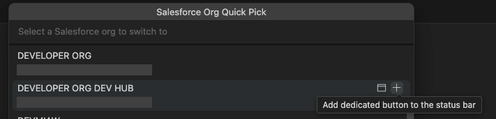

# Salesforce Org Quick Pick

A replacement for the Salesforce Org Management status bar org picker.

## Features

- **Show only orgs relevant to the current project**

  Easily find the org you need by showing only those that are relevant to the current project.

- **Dedicated status bar buttons for your most used orgs**

  Quickly switch to your most used orgs from dedicated status bar buttons without breaking your flow. To avoid cluttering your status bar:
  - When a dedicated button fot the current org exists, the main picker label is hidden to save space.
  - You can set short names for these buttons.

  

- **Choose the browser you want to use to open orgs**

  Use your preferred browser to open Salesforce when different from the default one.

- **Automatic sync with Salesforce Org Management**

  The extension updates its UI when switching orgs via Salesforce Org Management picker.

## Configuration

Configure the extension through VS Code settings (`Ctrl/Cmd + ,` and search for "Salesforce Org Quick Pick").

### Settings

- **`salesforceOrgQuickPick.orgFilters`**: Array of glob patterns to filter org aliases (usually set at project level)
  - If empty, all orgs are shown
  - Examples: `"DEV*"`, `"PROD"`, `"*TEST*"`

- **`salesforceOrgQuickPick.browser`**: Browser to use when opening orgs
  - `"default"`: Use system default browser
  - `"chrome"`: Google Chrome
  - `"firefox"`: Mozilla Firefox
  - `"safari"`: Safari
  - `"edge"`: Microsoft Edge

- **`salesforceOrgQuickPick.aliasLabels`**: Custom labels for org aliases (usually set at project level)
  - Map long alias names to short display labels
  - Example: `{"my-very-long-alias-name": "DEV"}`

- **`salesforceOrgQuickPick.hideMainLabelWhenDedicatedExists`**: Hide main picker label (the name of the current target org) when a dedicated item exists for the org

- **`salesforceOrgQuickPick.showOpenOrgButton`**: Show _Open Org in browser_ button in status bar

## License

This project is licensed under the MIT License.